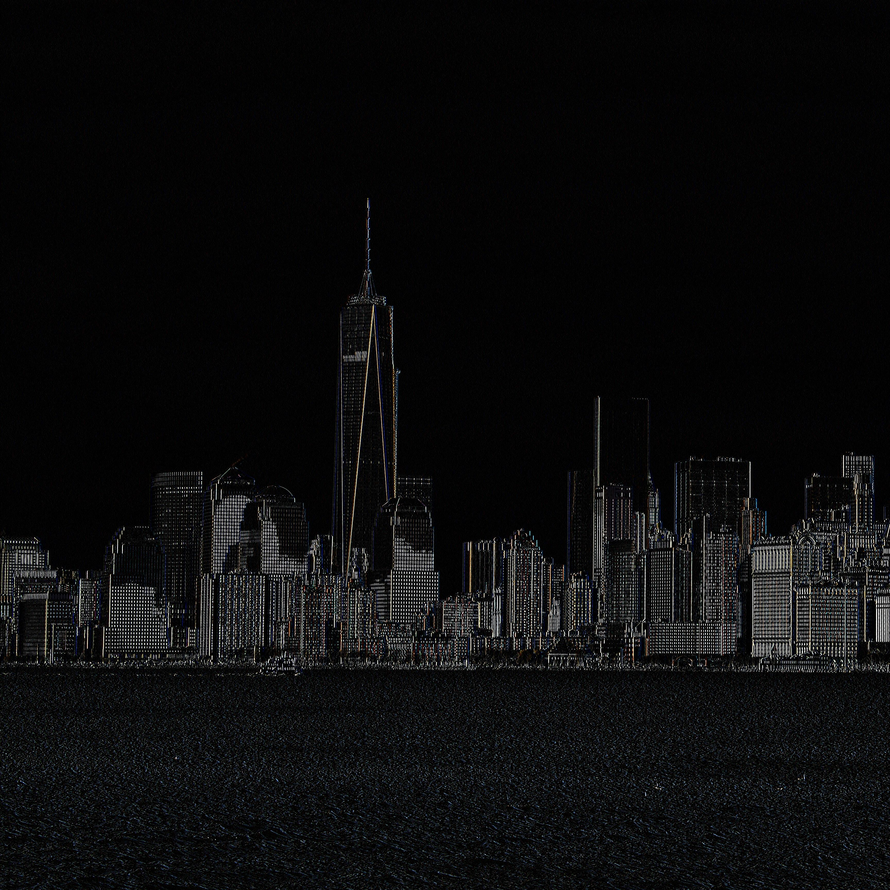
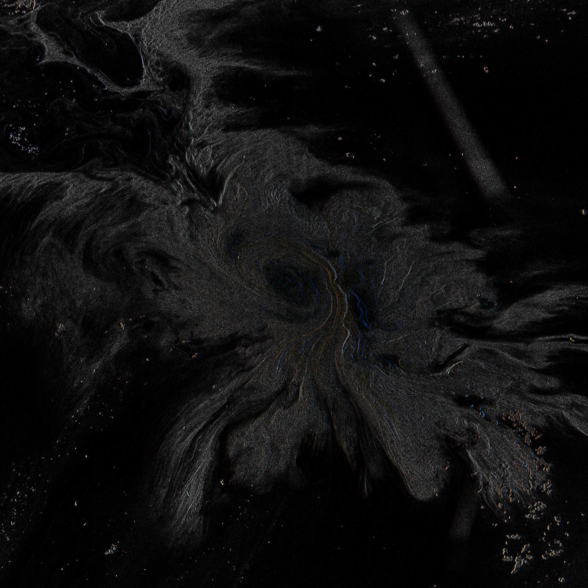

# Parallel stencil computations

Parallel implementation of stencil computations, also known as ISLs, using OpenMPI and OpenMP for distributed computing.

## Description

This repository contains the project for the UniTN HPC course for a.y. 2024-2025.

Table of contents:
- [External resources](#external-resources)
- [Getting started](#getting-started)
- [Compile](#compile)
- [Executing program](#executing-program)
- [Python scripts](#python-scripts)
- [Expand program](#expand-program)
- [Authors](#authors)

## External resources
In order to keep the repository simple and clear, all the results obtained from testing, such as logs and output images, are stored in a dedicated Drive folder that can be visited at the following [link](https://drive.google.com/drive/folders/1WYopG-qn7wH-KGPl-lkGrmz7BLWW1qOd?usp=sharing).

## Getting Started

### Installing

Clone the repository

```
git clone https://github.com/simrossi/parallel_stencil
```

Before building the project and test it, make sure that you have all the dependencies installed.

### C - dependencies
* OpenMPI
* OpenMP (optional)

To install everything simply type
```bash
sudo apt update
sudo apt install openmpi-bin libopenmpi-dev
```
### Python - dependencies
* Matplotlib
* OpenCV
* Pygame

To be sure that every Python dependency is installed simply type:
```bash
pip check
```

or simply give as input the `requirements.txt` file to pip. It will automatically download all necessary dependencies that are not already installed.
```bash
pip install -r requirements.txt
```

### Compile
After installing all the dependencies, compile the project with Make as it follows:

```
cd parallel_stencil
make
```

### Executing program

The program processes an input file containing a matrix and generates an output file with the resulting matrix. The file format consists of two rows: the first row specifies the dimensions, and the second row contains the continuous data.

The implementation allows for a sequential execution and a parallel execution by simply including or excluding the macro `PARALLEL` in `main.c`, line 13.

In case of any modification, a re-compiling is required trough
```
make clean && make
```

In case of sequential execution you can simply type:
```
./stencil -i <input_file> -o <output_file> [-l <log_file>]
```

In the case of parallel execution, you can also define the number of processes to be generated by:
```
mpiexec -np n ./stencil -i <input_file> -o <output_file> [-l <log_file>]
```
where `n` defines the number of processes.

To change the stencil and the operation to perform modify the arguments provided to `init_stencil()` in `src/main.c`.
A list of different stencils can be found in `src/patterns.h` while all different operations are contained in `src/operations.h`.

### Python scripts

The folder `scripts/` contains some python scripts that can be used to perform various operations.

#### Image
One of them is `image.py` which allows to apply the stencil computation to a provided image.

```
./image.py <number of processes> <stencil_binary> <image> <output_directory> [output log]
```

The command above will save the resulting image in the specified `output_directory`.

#### Video

`video.py` allows to apply the stencil computation to a video which is just a composition of images (frames).

```
./video.py <number of processes> <stencil_binary> <video_path> <output_dir> <video name output>
```

The command above will save the extracted frames and the computed ones in the specified `output_directory` and generate a new video with the name `video name output`.
The new `video name` MUST contain also a proper `extension` such as mp4, mp3.

Keep in mind that if the video has a large resolution and/or contains lot of frames it might require lot of computation and also space as it need to save a pair of images for each frame.

#### Examples of outputs

<p style="display:flex; justify-content: space-around">
    
    
</p>

<p style="display:flex; justify-content: space-around">
    
    
</p>

The folder `outputs` contains the examples showed above and other image / video outputs generates by applying ISLs.

#### ISL Simulation
It is possible to save the output matrix of each iteration and generate an animation that simulates the evolution of the input matrix.

First of all it is important to execute the binary file with the specific parameter `-s`.
```
./stencil -i <input_file> -o <output_file> -s <results_folder>
```
The folder, which must be created prior, will be filled with the matrix obtained at each iteration.

You can then simply execute the python script
```
python3 isl_simulation.py <input_file> <results_folder>
```

#### Time and benchmark plotters
Both scripts have been used for the analysis of the testing phase as it allows to compare the execution times and the efficiency of different configurations.
More precisely:
- time plotter compares the execution times based on the logs generated
- benchmark allows the analysis of both speedup and efficiency of the different configurations tested

```
python3 log_time_plotter.py <log file1> <log file2> ...

python3 log_benchmark_plotter.py log_sequential log_parallel_nX log_parallel_nY ... [-e]
```

### Expand program

The program can be expanded by adding new stencils and new operations:
* To add a new stencil create a funcion declaration in `src/patterns.h` and its definition in `src/patterns.c`.
* To add a new operation create a function declaration in `src/operations.h` and its definition in `src/operations.c`.

You can guide yourself by looking at already existing stencils and operations.
Don't forget to apply your new changes by running `make clean && make`.

## Authors

Contributors names and contact info

Simone Rossi: [@simrossi](https://github.com/simrossi) [257777]

Dorijan Di Zepp: [@najirod02](https://github.com/najirod02) [257827]

## License

This project is licensed under the GPLv3 License - see the LICENSE file for details