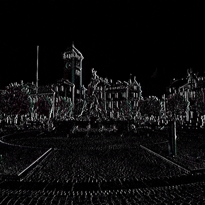
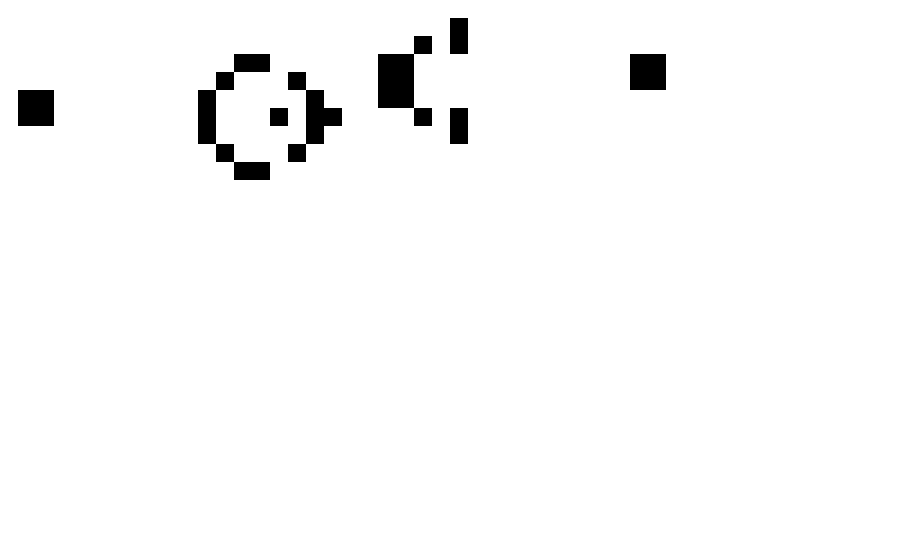

# Parallel stencil computations

Parallel implementation of stencil computations, also known as iterative stencil loops, using OpenMPI and OpenMP for distributed computing.

## Description

This repository contains the project for the UniTN HPC course for a.y. 2024-2025.

Table of contents:
- [External resources](#external-resources)
- [Getting started](#getting-started)
- [Compile](#compile)
- [Executing program](#executing-program)
- [Python scripts](#python-scripts)
- [Expand program](#expand-program)
- [Authors](#authors)

## External resources
In order to keep the repository clean, all the results obtained from bench-marking the application, such as logs and plots, are stored in a dedicated Drive folder [Drive folder](https://drive.google.com/drive/folders/1WYopG-qn7wH-KGPl-lkGrmz7BLWW1qOd?usp=sharing).

## Getting Started

### Installing

Clone the repository

```
git clone https://github.com/simrossi/parallel_stencil
cd parallel_stencil
```

Before building the project, make sure that you have all the dependencies installed.

### C - dependencies
* OpenMPI
* OpenMP

To install the C dependencies on Ubuntu based systems simply run the following command:
```bash
sudo apt update
sudo apt install openmpi-bin libopenmpi-dev
```

### Python - dependencies
* OpenCV
* Matplotlib
* Numpy
* Pillow
* Pygame

To install the python dependencies simply run the following command:
```bash
pip install -r requirements.txt
```

### Compile
After installing all the dependencies, compile the project with Make as it follows:

```
make
```

### Executing program

The program processes an input file containing a matrix and generates an output file with the resulting matrix. The file format consists of two rows: the first row specifies the dimensions, and the second row contains the continuous data.

The implementation allows for sequential and parallel execution that can be toggled by simply including or excluding the macro `PARALLEL` in `main.c`, line 14.

In case of any modification, the program needs to be recompiled using:
```
make clean && make
```

To run the program, when performing a sequential execution you can simply type the following command:
```
./stencil -i <input_file> -o <output_file> [-n <iterations>] [-l <log_file>]
```

During parallel execution, you can define the number of processes to be used as following:
```
mpiexec -np <procs> ./stencil -i <input_file> -o <output_file> [-n <iterations>] [-l <log_file>]
```
where `procs` defines the number of processes.

To change the stencil and the operation to perform modify the arguments provided to `init_stencil()` in `src/main.c`.
A list of different stencils can be found in `src/patterns.h` while all different operations are contained in `src/operations.h`.

### Python scripts

The folder `scripts/` contains some python scripts that can be used to perform various operations.

#### Image
One of them is `image.py` which allows to apply the stencil computation to a provided image.

```
./image.py <num_of_procs> <stencil_binary> <input_image> <output_dir> [log_file]
```

The command above will save the resulting image in the specified `output_directory`.

#### Video

`video.py` allows to apply the stencil computation to a video which is just a composition of images (frames).

```
./video.py <num_of_procs> <stencil_binary> <input_video> <output_dir> <output_video>
```

The command above will save the extracted frames and the computed ones in the specified `output_dir` and generate a new video with the name `output_video`.
The `output_video` filename **must** contain a proper video `extension` such as mp4.

Keep in mind that if the video has a large resolution and/or contains lot of frames it might require lot of computation and also space as it need to save a pair of images for each frame.

#### Miscellaneous

Other python scripts where developed.
- `to_binary.py` and `from_binary.py` allow to convert input and output to and from a binary format which could save storage space in specific situations in which the float data contains a lot of decimal digits.
- `create_gif.py` when computing a 2D matrix and providing the intermediate output, created using the `--save-intermediate` option, allows to generate GIFs where each frame correspond to the output of one iteration.
- `conways_editor.py` enable you to quickly edit an input file by providing an interface for quickly toggling cells. The output from this script can be used to simulate Conway's game of life using the `conways` stencil and the `conways_gol` operation.

#### Examples of outputs

##### Image examples
<p style="display:flex; justify-content: space-around">
    
    
</p>
<p style="display:flex; justify-content: space-around">
    
    
</p>

##### Video examples
<p style="display:flex; justify-content: space-around">
	
    
</p>

##### Conway's game of life
<p style="display:flex; justify-content: space-around">
	
</p>

The folder `outputs` contains the examples showed above and other image / video outputs generates by applying ISLs.

#### ISL Simulation
It is possible to save the output matrix of each iteration and generate an animation that simulates the evolution of the input matrix.

First of all it is important to execute the binary file with the specific parameter `-s`.
```
./stencil -i <input_file> -o <output_file> -s <results_folder>
```
The folder, which must be created prior, will be filled with the matrix obtained at each iteration.

You can then simply execute the python script
```
python3 isl_simulation.py <input_file> <results_folder>
```

#### Time and benchmark plotters
Both scripts have been used for the analysis of the testing phase as it allows to compare the execution times and the efficiency of different configurations.
More precisely:
- Time plotter compares the execution times based on the logs generated.
- Benchmark allows the analysis of both speedup and efficiency of the different configurations tested.

```
python3 log_time_plotter.py <log_file1> <log_file2> ...

python3 log_benchmark_plotter.py log_sequential log_parallel_nX log_parallel_nY ... [-e]
```

### Expand program

The program can be expanded by adding new stencils and new operations:
* To add a new stencil create a funcion declaration in `src/patterns.h` and its definition in `src/patterns.c`.
* To add a new operation create a function declaration in `src/operations.h` and its definition in `src/operations.c`.

You can guide yourself by looking at already existing stencils and operations.
Don't forget to apply your new changes by running `make clean && make`.

## Authors

Contributors names and contact info

Simone Rossi: [@simrossi](https://github.com/simrossi)

Dorijan Di Zepp: [@najirod02](https://github.com/najirod02)

## License

This project is licensed under the GPLv3 License - see the LICENSE file for details
